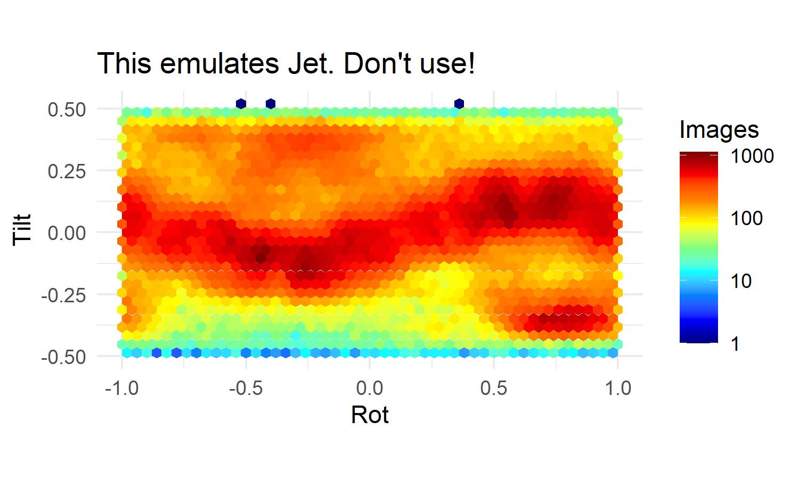

# Orientation plotter

The default plots made by cryoSPARC use the Jet colorscheme, which
has been [shown time and again](https://bids.github.io/colormap/) to be
deceptive and difficult to read.

This script reads a star file, converts it to a csv of orientations, and
then re-plots the particle orientation heatmap in a viridis color scheme to get
a sense of the true bias.

Compare the two plots of the same data below:

Additionally, this script produces a polar representation of the data

